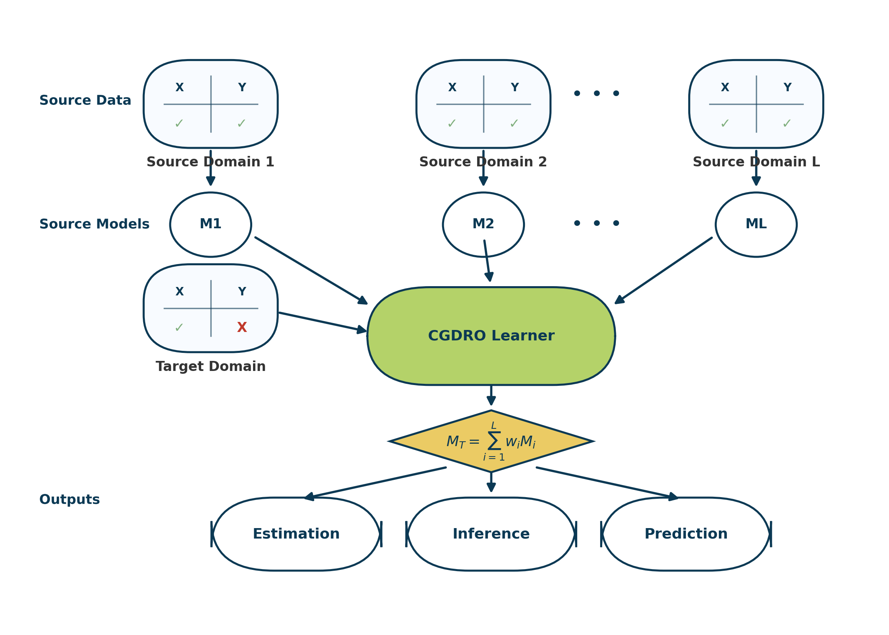

<!-- ===============================
     CGDRO Home Page (Landing)
     File: docs/index.md
     =============================== -->


<!-- HERO SECTION -->
<div class="cgdro-hero">
  <div class="cgdro-hero__overlay">
    <h1 class="cgdro-hero__title">CGDRO, your go-to solution for multi-source learning.</h1>
    <p class="cgdro-hero__subtitle">
      Integrate diverse data sources, provide robust prediction and statistical inference on your target domain.
    </p>
    <div class="cgdro-hero__actions">
      <a class="md-button md-button--primary" href="setup/intro/">Get started</a>
      <a class="md-button" href="#learn-more">Learn more</a>
    </div>
  </div>
</div>

<!-- CONTENT SECTIONS -->
<div id="learn-more"></div>


## Why CGDRO?
<!-- detail left blank for now -->
{.float-right}

CGDRO provides conprehensive multi-source prediction and model statistical inference without knowing target labels, offering multi-source solutions to low-dimensional and high-dimensional, linear and complex data, regression and classification problems. CGDRO is easy to incorporate various machine learning and deep learning methods into the data integration process, which can be widely applied in biomedical, financial, environmetal scientifical problems.

&nbsp;

## What is CGDRO?
<!-- detail left blank for now -->
CGDRO, Conditional Group Distributionally Robust Optimization, is designed for multi-source domain adaptation probelm with no labels on the target domain. Different from ERM (Empirical Risk Minimization), CGDRO offers robust estimation, prediction, and statistical inference by optimizing **worst-case** risk within an uncertainty set.

We have the CGDRO estimator is:

$$
f_{\theta^*} = \arg\min_\theta \max_{\mathbf{T} \in \mathcal{C}}
\mathbb{E}_{(X, Y)\sim \mathbf{T}} \ell(X, Y; f_\theta).
$$

Where $\mathcal{C}$ is the uncertainty set. Then, by resampling-based methods, we can construct valid confidence interval of the estimators on the target domain.

&nbsp;

## Citations
> 🧾 This section will include formal citations to our paper and related works later.
>
> ```
> (Citations placeholder)
> ```

---

<p style="text-align:center; font-size: 0.9rem; margin-top: 2rem;">
  © 2025 CGDRO • Authors: <a href="about/authors/">Team</a> •
  Visits: <span id="cgdro-counter">—</span>
</p>

<script>
  // Local visit counter (placeholder)
  const key = 'cgdro-visit-count';
  const n = parseInt(localStorage.getItem(key) || '0', 10) + 1;
  localStorage.setItem(key, String(n));
  document.getElementById('cgdro-counter').textContent = n.toLocaleString();
</script>
