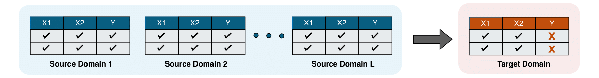

<!-- ===============================
     CGDRO Home Page (Landing)
     File: docs/index.md
     =============================== -->

<!-- HERO SECTION -->

  

    <h1 class="cgdro-hero__title">CGDRO, multi-source learning with no target labeled data.</h1>
    

      Integrate diverse data sources, provide robust prediction and statistical inference on your target domain.
    

    

      <a class="md-button md-button--primary" href="setup/intro/">Get started</a>
      <a class="md-button" href="#learn-more">Learn more</a>
    

  

<!-- CONTENT SECTIONS -->

In many real-world applications, we often need to make predictions in a new environment where no labeled data are available. For instance, consider training models on patient records from several hospitals, and then deploying them in a new hospital whose patient population may differ. Each source hospital offers valuable information, but their data distributions may vary from the target one, making direct model transfer unreliable.
This setting, known as multi-source unsupervised domain adaptation (MSDA), presents a fundamental challenge:

How can we learn a model that performs reliably on the unlabeled target domain, 
by leveraging the labeled source domains?

Figure <a href="#fig-msda">1</a>  provides a visual illustration of this setup.
<figure id="fig-msda" class="wide-caption" markdown="block">
  
  <figcaption markdown="span">
    Figure 1. Illustration of Multi-source Unsupervised Domain Adaptation.
    Each source domain provides labeled data, while the target domain contains only unlabeled data. ([Guo et al. (2025)](/setup/intro/#ref-guo2025statistical))
  </figcaption>
</figure>

The CGDRO package is designed to tackle exactly this problem. CGDRO stands for Conditional Group Distributionally Robust Optimization, a principled framework for constructing prediction models that are robust across domains. It not only learns models that generalize to unseen target distributions, but also includes built-in statistical inference tools, enabling users to quantify uncertainty and perform hypothesis testing on model parameters.

---

  © 2025 CGDRO • Authors: <a href="about/authors/">Team</a>

