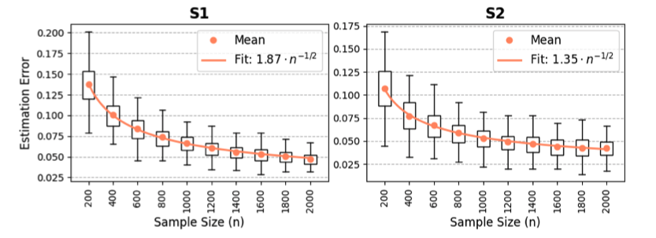

# CGDRO-Classification
With the uncertainty class

\[
\mathcal{C}_{\mathcal{H}} := \left\{ \left(\mathrm{Q}_X, T_{Y\mid X}\right) : T_{Y\mid X} = \sum_{l=1}^L q_l \cdot \mathbf{P}^{(l)}_{Y\mid X},\; q \in \mathcal{H} \subseteq \Delta^L \right\},
\]

we aim to solve the following minimax optimization problem:

\[
\arg\min_{f_\theta} \ \max_{T \in \mathcal{C}_\mathcal{H}} \ \mathbb{E}_{(X, Y)\sim T}\bigl[\ell(X, Y; f_\theta)\bigr],
\]

where $f_\theta(x)$ denotes a prediction model (which can be a linear model $f_\theta(x)=\theta^\intercal x$ or a more flexible form, such as a neural network). As for the **classification** task, CGDRO solves a minimax optimization with cross-entropy loss. We consider the **categorical outcome variable $Y$** taking values from $\{0,1,...,K\}$with $K \geq 1$, with the binary classification setting corresponding to the special case with $K = 1$.

We define the cross-entropy loss function as,

$$
\ell(X,Y,\theta)= - \sum_{c=0}^{K} 1(Y=c)\log\left[\frac{\exp(\theta_c^\top X)}
{1+\sum_{k=1}^K \exp(\theta_k^\top X)}\right],
$$

with each class-specific parameter vector $\theta_c\in\mathbf{R}^d$ for $c\in\{0,1,...,K\}$. For identifiability, we set class $c=0$ as the reference category and fix $\theta_0$ as a zero vector. We then stack the remaining parameters into a single vector $\theta=(\theta_1^\top, \theta_2^\top,\ldots,\theta_K^\top)^\top\in\mathbf{R}^{dK}$, which represents the parameters of the predictive model. In the context of cross-entropy loss, we further simplify the CGDRO model as follows,

$$
\theta^*=\arg\min_{\theta\in\mathbf{R}^{dK}} \max_{\gamma\in \Delta^L} \ \phi(\theta,\gamma)
\qquad \text{with}\qquad 
\phi(\theta,\gamma):=\sum_{l=1}^L \gamma_l \cdot \theta^\top \mu^{(l)} + S(\theta),
\tag{6}
$$

where $\mu^{(l)}=\bigl[(\mu^{(l)}_1)^\top, (\mu^{(l)}_2)^\top,\cdots, (\mu^{(l)}_K)^\top \bigr]^\top\in\mathbf{R}^{dK}$ with 
$\{\mu^{(l)}_c\}_{1\le c\le K}$ defined as,

$$
\mu_c^{(l)} = -\mathbb{E}_{X\sim Q_X}\mathbb{E}_{Y\sim P^{(l)}_{Y|X}} \bigl[1(Y=c)\cdot X\bigr], 
\qquad
S(\theta)=\mathbb{E}_{X\sim Q_X}\log\left[1+\sum_{c=1}^K \exp(\theta_c^\top X)\right].
\tag{7}
$$

In the above definition, $\mu^{(l)}_c$ measures the association between the one-hot encoding $1(Y=c)$ and $X\in\mathbf{R}^d$. The vector $\mu^{(l)}$ is constructed by stacking the class-specific vectors $\{\mu^{(l)}_c\}_{1\le c\le K}$ and does not depend on the source index $l$.

A key difficulty of CGDRO with cross-entropy loss is that, unlike in the regression setting, the model does not admit a closed-form update. In regression models, the inner maximization over the group weights $\gamma$ and the minimization over $\theta$ lead to quadratic objectives, making closed-form solutions or simple convex programs available. In contrast, the cross-entropy loss introduces the 
smooth but non-quadratic objective, the minimization over $\theta$ does not have an analytic solution, and the min-max optimization problem cannot be solved using closed-form formulas. Therefore, we employ the Mirror Prox algorithm, which is well-suited for smooth convex--concave saddle-point problems and provides stable, first-order updates for both $\theta$ and $\gamma$.

To empirically solve the CGDRO problem, we first need to empirically estimate $\{\mu^{(l)}\}_{1\leq l \leq L}$ and $S(\theta)$ utilizing the observed data as $\{\hat{\mu}^{(l)}\}_{1\leq l \leq L}$ and $\hat{S}(\theta)$. 

Here, $\widehat{S}(\theta)$ is computed over the unlabeled target data $\{X_i^{\mathrm{Q}}\}_{1\le i \le N}$ as follows:

$$
\widehat{S}(\theta)
= \frac{1}{N}\sum_{i=1}^N 
\log\left( 1 + \sum_{k=1}^K \exp(\theta_k^\top X_i^{\mathrm{Q}}) \right).
$$

As for $\{\hat{\mu}^{(l)}\}_{1\leq l \leq L}$, we compute them on each source without covariate shift and apply a Double Machine Learning (DML) estimator to reduce the estimation bias, which is required for valid statistical inference. For more details about DML estimator, please go to the paper [Guo et al. (2025)](#ref-guo2025statistical).

## Mirror Prox Optimization and Statistical Rate

Given the estimated moment vectors $\{\widehat{\mu}^{(l)}\}_{l\in[L]}$ and the target log-partition estimate $\widehat{S}(\theta)$, the minimax CGDRO objective can be efficiently optimized using the data-dependent Mirror Prox Algorithm. The algorithm performs two first-order updates at each iteration---an intermediate step and a correction step---and updates both the model parameter $\theta$ and the adversarial group weights $\gamma$ via gradient and exponentiated-gradient operations. The final estimators $(\widehat{\theta},\widehat{\gamma})$ are obtained by averaging the Mirror Prox iterates when the duality gap falls below a chosen tolerance.

**Algorithm 1: Data-dependent Mirror Prox Algorithm**

!!! example "Algorithm 1: Data-dependent Mirror Prox Algorithm"

    **Data:** Estimated $\{\widehat{\mu}^{(l)}\}_{l\in[L]}$; target covariates $\{X_j^{\mathrm{Q}}\}_{j\in[N]}$; learning rates for Mirror Prox: $\eta_\theta, \eta_\gamma$; maximum iteration $T$, tolerance $\epsilon$.

    **Result:** Mirror Prox estimators $\widehat{\theta}_T, \widehat{\gamma}_T$.

    Set $\theta_0=\bar{\theta}_0=0$, $\gamma_0=\bar{\gamma}_0=(1/L,\cdots,1/L)$, and $\mathrm{gap}=1$. 

    **while** $0\le t\le T$ **and** $\mathrm{diff}\ge\epsilon$ **do**

     **Intermediate Step:**

    $$
    \bar{\theta}_{t+1} = \theta_t - \eta_\theta \cdot \nabla_\theta \widehat{\phi}(\bar{\theta}_t,\bar{\gamma}_t), \ \text{and}
    $$

    $$
    [\bar{\gamma}_{t+1}]_l =
    \frac{
    \gamma_{t,l}\cdot \exp\!\left(\eta_\gamma \cdot \left[ \nabla_\gamma \widehat{\phi}(\bar{\theta}_t,\bar{\gamma}_t) \right]_l\right)
    }{
    \sum_{j=1}^L \gamma_{t,j} \cdot \exp\!\left(\eta_\gamma \cdot \left[ \nabla_\gamma \widehat{\phi}(\bar{\theta}_t,\bar{\gamma}_t) \right]_j\right)
    },
    \qquad 1\le l\le L.
    $$

      **Correction Step:**

    $$
    \theta_{t+1} = \theta_t - \eta_\theta \cdot \nabla_\theta \widehat{\phi}(\bar{\theta}_{t+1},\bar{\gamma}_{t+1}), \ \text{and}
    $$

    $$
    [\gamma_{t+1}]_l =
    \frac{
    \gamma_{t,l}\cdot \exp\!\left(\eta_\gamma \cdot \left[ \nabla_\gamma \widehat{\phi}(\bar{\theta}_{t+1},\bar{\gamma}_{t+1}) \right]_l\right)
    }{
    \sum_{j=1}^L \gamma_{t,j} \cdot \exp\!\left(\eta_\gamma \cdot \left[ \nabla_\gamma \widehat{\phi}(\bar{\theta}_{t+1},\bar{\gamma}_{t+1}) \right]_j\right)
    },
    \qquad 1\le l\le L.
    $$

     Set $\widehat{\theta}_t = \frac{1}{t}\sum_{s=1}^t \bar{\theta}_s$, and $\widehat{\gamma}_t = \frac{1}{t}\sum_{s=1}^t \bar{\gamma}_s$.

     Evaluate the duality gap:

    $$
    \mathrm{gap} = \max_{\gamma\in\Delta^L} \widehat{\phi}(\widehat{\theta}_t,\gamma)
    \;-\;
    \min_{\theta\in\mathbf{R}^{dK}} \widehat{\phi}(\theta,\widehat{\gamma}_t).
    $$

    **end while**
    
    Denote $\widehat{\theta}_T=\widehat{\theta}_t$ and $\widehat{\gamma}_T=\widehat{\gamma}_t$, after convergence.

The Mirror Prox Algorithm above performs gradient descent on $\theta$ and mirror ascent on $\gamma$ due to the simplex constraint. Therefore, we first present the expressions of the gradients of $\hat{\phi}(\theta, \gamma)$ with respect to $\theta$ and $\gamma$. Given the expressions $\hat{\mu}^{(l)}$, $\hat{S}(\theta)$, it holds

\[
\nabla_{\theta} \hat{\phi}(\theta,\gamma)
=
\left(
  \left[
    \sum_{l=1}^L \gamma_l \cdot \hat{\mu}_1^{(l)} + \nabla_{\theta_1} \hat{S}(\theta)
  \right]^{\top},
  \;\cdots,\;
  \left[
    \sum_{l=1}^L \gamma_l \cdot \hat{\mu}_K^{(l)} + \nabla_{\theta_K} \hat{S}(\theta)
  \right]^{\top}
\right),
\]

\[
\nabla_{\gamma} \hat{\phi}(\theta, \gamma)
=
\left(
  \theta^\top \hat{\mu}^{(1)},\;
  \cdots,\;
  \theta^\top \hat{\mu}^{(L)}
\right).
\]

Each iteration for Mirror Prox consists of two sequential steps: an **intermediate step** that computes an intermediate point to better estimate the gradient direction, followed by a **correction step** that updates from the current iterate using gradients evaluated at the intermediate point. The literature has shown that this two-step procedure effectively reduces oscillations near saddle points and achieves faster convergence rates in smooth convex-concave settings. Such a two-step procedure facilitates Mirror Prox yielding a fast optimization convergence rate of $\mathcal{O}(T^{-1})$. In contrast, without computing intermediate points for gradient evaluation as in the Mirror Prox, the single-step algorithm with gradient descent–mirror ascent yields a slower optimization convergence rate of $\mathcal{O}(T^{-1/2})$.

A key advantage of this approach is that, under mild regularity conditions, the estimator $\widehat{\theta}$ achieves a **sharp statistical convergence rate**:

$$
\|\widehat{\theta}-\theta^*\|_2 \lesssim \sqrt{\frac{d}{n}},
$$

up to a multiplicative constant factor $\tau$, whereas $n = \min{\{n_l\}_{1\leq l\leq L}}$. This rate improves upon the slower guarantees typically obtained by GroupDRO-type procedures. The Mirror Prox procedure uses the structure of the saddle-point problem more effectively, leading to a statistically faster estimator.

**Empirical Illustration.**
Figure <a href="#rate">1</a> reports the estimation error of the CGDRO classifier under covariate shift for two settings: **S1** (binary classification) and **S2** (multi-class classification). In both scenarios, the proposed estimator exhibits a clear $\mathcal{O}(\sqrt{d/n})$ convergence pattern as the source sample size increases. The fitted curves closely follow the $n^{-1/2}$ decay rate, validating the theoretical results in our main paper. Moreover, the estimation error decreases steadily in both binary and multi-class settings, demonstrating the robustness of the proposed CGDRO method under covariate shift.

<figure id="rate" class="wide-caption" markdown="block">
  
  <figcaption markdown="span">
  Figure 1. Estimation error under covariate shift. S1: binary classification; S2: multi-class classification. In both cases, the estimation error decays at the $\sqrt{d/n}$ rate. ([Guo et al. (2025)](#ref-guo2025statistical))
  </figcaption>
</figure>

These empirical findings are fully consistent with the sharp theoretical convergence guarantees established in [Guo et al. (2025)](#ref-guo2025statistical).

## Statistical Inference
The package provides statistical inference tools for classification scenario. We provide interval estimates and hypothesis tests for each individual coordinate $\theta_j^*$ with $1\leq j\leq d$. For readers interested in the theoretical development and technical details underlying the following discussions, we refer to [Guo et al. (2025)](#ref-guo2025statistical), which provides a comprehensive treatment of the statistical properties of the CGDRO estimator.

### Core Challenge

Statistical inference for CGDRO classification is fundamentally more difficult than in the linear-model setting.  The estimator $\widehat{\theta}$ is defined implicitly as the solution to a
nonlinear minimax problem:

$$
\theta^*=\arg\min_{\theta\in\mathbf{R}^{dK}}\max_{\gamma\in\Delta^L}\phi(\theta,\gamma),
\qquad
\widehat{\theta}
=\arg\min_{\theta}\max_{\gamma}\widehat{\phi}(\theta,\gamma),
$$

where the objective involves a softmax log-partition term and data-dependent moment estimates.  Unlike regression, no closed-form representation of $\theta^*$ exists; its sampling distribution must be analyzed entirely through the behavior of the minimax operator.

Recent theoretical results show that the empirical distribution of $\widehat{\theta}$ can be **non-Gaussian**, often biased, multimodal, or concentrated away from the true value. Two fundamental mechanisms shown Figure <a href="#infer">2</a> , both arising from the optimization geometry, lead to this nonstandard limiting behavior:

- **(Nonregularity) Boundary behavior of the data-driven weight $\widehat{\gamma}$.**
    When the source-specific logits differ only sparsely across coordinates, the minimax objective places more emphasis on the source with smaller signal strength.  As a result, the population weight $\gamma^*$ lies near the boundary of the simplex, and the estimator $\widehat{\gamma}$ often hits the boundary (e.g. $\widehat{\gamma}_l=0$ with positive probability). This induces discontinuities in the mapping $\widehat{\gamma}\mapsto\widehat{\theta}$ and produces a nonregular,
    nonnormal distribution for $\widehat{\theta}$.

- **(Instability) Sensitivity to nearly indistinguishable sources.**
    When the conditional models of two sources are very similar, the
    empirical minimax problem cannot reliably separate them.  The estimated weight $\widehat{\gamma}$ may then fluctuate widely between $0$ and $1$across samples, even when $\gamma^*$ is interior.  This instability propagates through the saddle-point mapping and leads to large variance and non-Gaussian behavior in $\widehat{\theta}$.

<figure id="infer" class="wide-caption" markdown="block">
  
  <figcaption markdown="span">
    Figure 2. Empirical distributions of $\widehat{\gamma}_1$ and $\widehat{\theta}_1$ in the nonregular, unstable, and regular settings. The top row corresponds to the first source's estimated weight $\widehat{\gamma}_1$, while the bottom row corresponds to the estimated $\widehat{\theta}_1$. Vertical red lines indicate true parameter values, while dashed green lines show the empirical average across 500 simulations. Blue histograms with overlaid kernel density estimates depict the empirical distributions of estimates across 500 simulations. ([Guo et al. (2025)](#ref-guo2025statistical))
  </figcaption>
</figure>

Both mechanisms reflect the intrinsic difficulty of inference under minimax optimization: the sampling distribution of $\widehat{\theta}$ becomes the image of a Gaussian perturbation of the objective function under a nonsmooth, highly nonlinear argmin–argmax operator.  
Consequently, classical asymptotic normality or delta-method approximations are invalid, necessitating a specialized inferential strategy.

### Perturbation-based Inferential Procedure

Let $\widehat{\gamma}^{[m]}$ denote the $m$-th perturbed version of the
estimated weight vector generated using the perturbation set $\mathcal{M}$. With high probability, one element of $\mathcal{M}$ is close to the true population minimax weight $\gamma^*$. This implies that the estimator

$$
\widehat{\theta}^{[m]}
:=\arg\min_{\theta}\widehat{\phi}(\theta,\widehat{\gamma}^{[m]})
$$

is asymptotically normal and centered at $\theta^*=\arg\min_{\theta}\phi(\theta,\gamma^*)$
for at least one index $m=m^*$.

Since the identity of $m^*$ is unknown, we form individual intervals for
every $m\in\mathcal{M}$ and take their union to obtain the final confidence
interval.

For each perturbed weight vector $\widehat{\gamma}^{[m]}$, the perturbed
estimator is

$$
\widehat{\theta}^{[m]}
=
\arg\min_{\theta\in\mathbf{R}^{dK}}
\widehat{\phi}(\theta,\widehat{\gamma}^{[m]})
=
\arg\min_{\theta}
\left\{
\sum_{l=1}^L \widehat{\gamma}^{[m]}_l\,
\theta^\top\widehat{\mu}^{(l)}
+
\widehat{S}(\theta)
\right\}.
\tag{37}
$$

When the target sample size satisfies $N\gg \max\{n_1,\ldots,n_L\}$, the
approximation

$$
\widehat{\theta}^{[m]}-\theta^*
\approx
-[H(\theta^*)]^{-1}
\sum_{l=1}^L
\left(\widehat{\gamma}^{[m]}_l-\gamma^*_l\right)\mu^{(l)}
-
[H(\theta^*)]^{-1}
\sum_{l=1}^L
\gamma_l^*
\left(\widehat{\mu}^{(l)}-\mu^{(l)}\right)
\tag{38}
$$

holds, where $H(\theta^*)$ is the Hessian of $S(\theta)$.
The first term captures the uncertainty from estimating $\gamma^*$, while
the second term leverages the asymptotic normality of $\widehat{\mu}^{(l)}$.

Given a significance level $\alpha>\alpha_0$, define
$\alpha'=\alpha-\alpha_0$ and construct the interval

$$
\mathrm{Int}^{[m]}
=
\left(
\widehat{\theta}^{[m]}_1 - z_{\alpha'/2}\widehat{\mathrm{SE}}^{[m]},\
\widehat{\theta}^{[m]}_1 + z_{\alpha'/2}\widehat{\mathrm{SE}}^{[m]}
\right),
\tag{39}
$$

where $\widehat{\mathrm{SE}}^{[m]}$ is the consistent estimator of the
standard error associated with the second term in (38).

Since $m^*$ is unknown, the final confidence interval is the union

$$
\mathrm{CI}
=\bigcup_{m\in\mathcal{M}}\mathrm{Int}^{[m]}.
\tag{40}
$$

This perturbation-based method guarantees valid coverage even when the
limiting distribution of $\widehat{\theta}$ is nonnormal or unstable.
It provides a practical inferential tool for nonlinear minimax estimators
arising in distributionally robust classification.

## References

**Guo, Z.**, **Wang, Z.**, **Hu, Y.**, & **Bach, F.** (2025). *Statistical Inference for Conditional Group Distributionally Robust Optimization with Cross-Entropy Loss.*  
*arXiv preprint* [arXiv:2507.09905](https://arxiv.org/abs/2507.09905)
