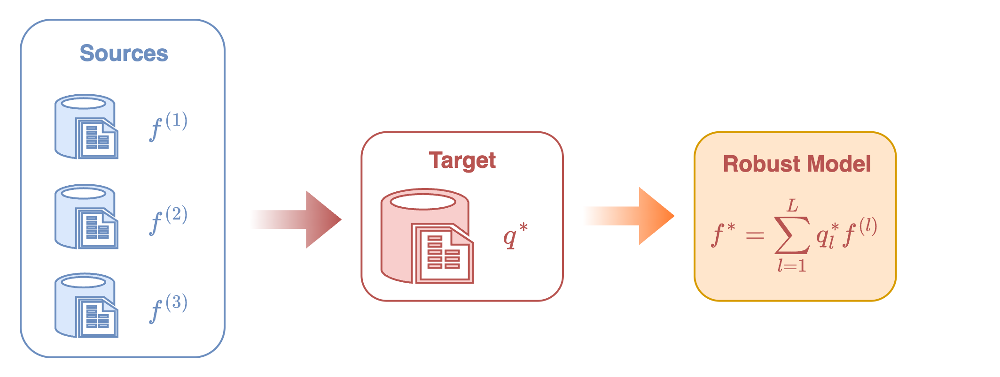
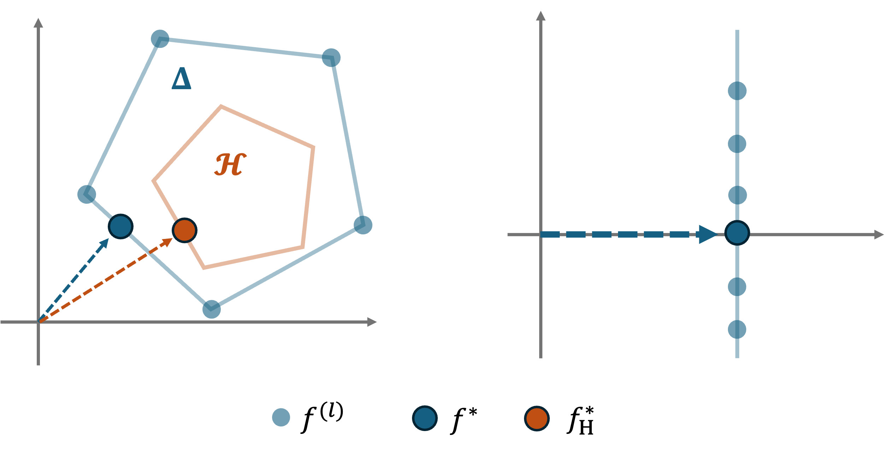
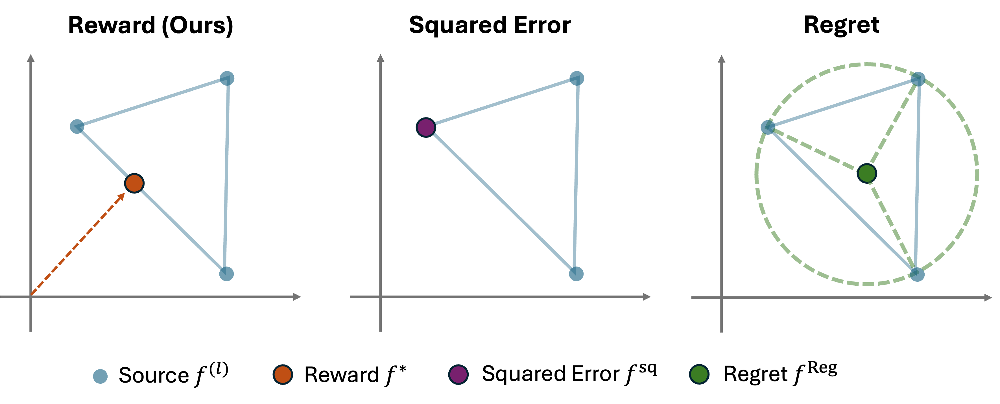
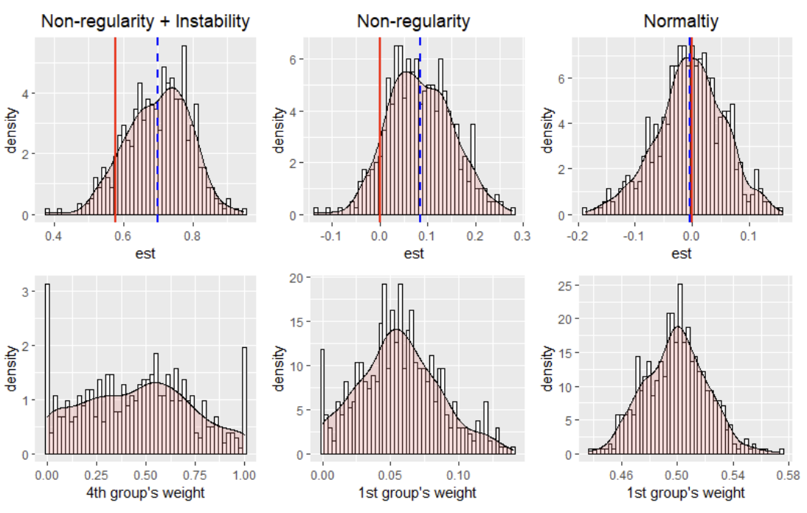

# CGDRO-Regression

With the uncertainty class

\[
\mathcal{C}_{\mathcal{H}} := \left\{ \left(\mathrm{Q}_X, T_{Y\mid X}\right) : T_{Y\mid X} = \sum_{l=1}^L q_l \cdot \mathbf{P}^{(l)}_{Y\mid X},\; q \in \mathcal{H} \subseteq \Delta^L \right\},
\]

we aim to solve the following minimax optimization problem:

\[
\arg\min_{f_\theta} \ \max_{T \in \mathcal{C}_\mathcal{H}} \ \mathbb{E}_{(X, Y)\sim T}\bigl[\ell(X, Y; f_\theta)\bigr],
\]

where $f_\theta(x)$ denotes a prediction model (which can be a linear model $f_\theta(x)=\theta^\top x$ or a more flexible form, such as a neural network). CGDRO provides three types of loss formulations described below.

- **Reward Function.**  
Given a pre-specified deterministic model $h$, the term

\[
\mathbb{E}_{T}\bigl[(Y-h(X))^2 - (Y-f_\theta(X))^2\bigr]
\]

quantifies the explained gain (or reward) of the model $f_\theta$ relative to $h$. It measures how much better $f_\theta$ predicts the outcome compared to the baseline model $h$ under the distribution $T$.

The worst-case reward across all plausible distributions in $\mathcal{C}_\mathcal{H}$ is

\[
\min_{T\in \mathcal{C}_\mathcal{H}} \mathbb{E}_T\bigl[(Y-h(X))^2 - (Y-f_\theta(X))^2\bigr].
\]

Maximizing this quantity corresponds to finding the model that achieves the greatest improvement in predictive power under the most adverse distributional shift.

A particularly meaningful case arises when we take the null model $h\equiv 0$. In this case, the reward term simplifies to

\[
\mathbb{E}_{T}\bigl[Y^2 - (Y-f_\theta(X))^2\bigr],
\]

which represents the proportion of variance in $Y$ explained by $f_\theta$ under distribution $T$, assuming $Y$ is centered. The corresponding robust model is thus defined as:

\[
f_{\theta^*}
:= \arg\max_{f_\theta}\min_{T\in \mathcal{C}_\mathcal{H}} \mathbb{E}_T\bigl[Y^2 - (Y-f_\theta(X))^2\bigr]
= \arg\min_{f_\theta}\max_{T\in \mathcal{C}_\mathcal{H}} \mathbb{E}_T\bigl[(Y-f_\theta(X))^2-Y^2\bigr].
\]

- **Squared Loss.**  
Another standard formulation minimizes the worst-case mean squared error (MSE):

\[
f_{\theta^{\mathrm{sq}}} := \arg\min_{f_\theta}\max_{T\in \mathcal{C}_\mathcal{H}} \mathbb{E}_T\bigl[(Y-f_\theta(X))^2\bigr].
\]

This model directly focuses on reducing the largest possible prediction error under distributional uncertainty.

- **Regret.**  
The regret of a model $f_\theta$ under distribution $T$ is defined as:

\[
\mathrm{Regret}_{T}(f_\theta)
:= \mathbb{E}_{T}\bigl[(Y-f_\theta(X))^2\bigr]
    - \inf_{\theta'}\mathbb{E}_{T}\bigl[(Y - f_{\theta'}(X))^2\bigr].
\]

This measures the excess risk of the model $f_\theta$ compared to the optimal model for the distribution $T$. The regret-based CGDRO then minimizes the worst-case excess risk:

\[
f_{\theta^{\mathrm{reg}}}
= \arg\min_{f_\theta} \max_{T\in \mathcal{C}_\mathcal{H}} \mathrm{Regret}_{T}(f_\theta).
\]

For more details about CGDRO regression, you can look up [Wang et al. (2023)](#ref-wang2023distributionally) about comparisons and identification of different loss functions in low-dimensional linear regression and flexible machine learning models. As for the debiased estimation in high-dimensional regression and statistical inference via perturbation for linear regression, you can go to [Guo et al. (2024)](#ref-guo2024statistical).

## Computational Challenge

We now introduce the main computational challenge of solving the preceding minimax optimization problems. Let us take the reward-based formulation of $f_{\theta^*}$ as an example, and for simplicity, consider the case without prior information. The model $f_{\theta^*}$ can be equivalently expressed as:

\[
\begin{aligned}
    f_{\theta^*}
    &= \arg\min_{f_\theta}\max_{T\in \mathcal{C}} \mathbb{E}_T\bigl[(Y-f_\theta(X))^2-Y^2\bigr] \\
    &= \arg\min_{f_\theta}\max_{q\in \Delta^L} \sum_{l=1}^L q_l\cdot 
    \mathbb{E}_{(X,Y)\sim (\mathrm{Q}_X, \mathbf{P}^{(l)}_{Y\mid X})}\bigl[(Y-f_\theta(X))^2-Y^2\bigr],
\end{aligned}
\]

where the second equality follows directly from the definition of the uncertainty class:

\[
\mathcal{C} := \left\{ \left(\mathrm{Q}_X, T_{Y\mid X}\right) : T_{Y\mid X} = \sum_{l=1}^L q_l \cdot \mathbf{P}^{(l)}_{Y\mid X}, \; q \in \Delta^L \right\}.
\]

In other words, the target conditional distribution is modeled as a convex mixture of the source conditionals.

This equivalent formulation reveals a critical issue: to evaluate the inner expectation

\[
\mathbb{E}_{(X,Y)\sim (\mathrm{Q}_X, \mathbf{P}^{(l)}_{Y\mid X})}\bigl[(Y-f_\theta(X))^2-Y^2\bigr],
\]

one needs access to paired data $(X,Y)$ jointly distributed according to $(\mathrm{Q}_X, \mathbf{P}^{(l)}_{Y\mid X})$. However, such samples are not observable, as we only have:

- labeled samples from source distributions $\mathbf{P}^{(l)}=(\mathbf{P}^{(l)}_X, \mathbf{P}^{(l)}_{Y\mid X})$, and
- unlabeled samples from the target covariate distribution $\mathrm{Q}_X$.

As a result, directly computing or optimizing this objective is impossible.

## Identification Strategy

To overcome this obstacle, CGDRO introduces a new identification strategy that expresses the unobservable expectations in terms of observable source data and target covariates.  
This reparameterization transforms the original minimax formulation into an equivalent problem that can be estimated directly from data.

The following theorem formalizes this idea.  
It shows that the seemingly complex minimax optimization can be equivalently rewritten as a single convex quadratic program, which not only makes computation feasible but also clarifies the interpretation of the learned model.

We introduce new notations first. For each labeled source domain $1\leq l\leq L$, let

\[
f^{(l)}(x) := \mathbb{E}\bigl[Y^{(l)}\mid X^{(l)}=x\bigr]
\]

denote the conditional mean (or conditional outcome model). We further define the corresponding noise as

\[
\varepsilon^{(l)} = Y^{(l)} - f^{(l)}\bigl(X^{(l)}\bigr),
\]

with the noise level

\[
\bigl[\sigma^{(l)}\bigr]^2 = \mathbb{E}\bigl[(\varepsilon^{(l)})^2 \mid X^{(l)}\bigr].
\]

Let the vector

\[
\boldsymbol{\sigma}^2 = \bigl([\sigma^{(1)}]^2,\dots,[\sigma^{(L)}]^2\bigr)
\]

collect all noise levels across sources.

!!! theorem "Identification Theorem"

    Under regularity conditions, the above mentioned robust models admit the following expressions:

    **Reward-based.**

    \[
    f_{\theta^*} = \sum_{l=1}^L q_l^* \cdot f^{(l)},
    \quad \text{with} \quad
    q^* = \arg\min_{q\in \mathcal{H}} q^\top \Gamma q .
    \]

    **Squared-error based.**

    \[
    f_{\theta^{\mathrm{sq}}} = \sum_{l=1}^L q_l^{\mathrm{sq}} \cdot f^{(l)},
    \quad \text{with} \quad
    q^{\mathrm{sq}} = \arg\min_{q\in \mathcal{H}}
    \left( q^\top \Gamma q - q^\top (\gamma + \boldsymbol{\sigma}^2) \right) .
    \]

    **Regret-based** (only works with no prior, i.e. \(\mathcal{H}=\Delta^L\)).

    \[
    f_{\theta^{\mathrm{reg}}} = \sum_{l=1}^L q_l^{\mathrm{reg}} \cdot f^{(l)},
    \quad \text{with} \quad
    q^{\mathrm{reg}} = \arg\min_{q\in \Delta^L}
    \left( q^\top \Gamma q - q^\top \gamma \right) .
    \]

    Here, \(\Gamma\in \mathbf{R}^{L\times L}\) is a symmetric matrix defined by

    \[
    \Gamma_{k,l}= \mathbb{E}\bigl[f^{(k)}(X^{\mathrm{Q}}) f^{(l)}(X^{\mathrm{Q}})\bigr]
    \quad \text{for } k,l\in \{1,\dots,L\},
    \]

    and \(\gamma=\mathrm{diag}(\Gamma)\) is the vector containing the diagonal entries.

This identification theorem reveals that all three types of robust models can be expressed as a **mixture** of source conditional models $\{f^{(l)}\}$, with the mixture weights determined by solving a convex quadratic program.  
In practice, this result provides a clear and efficient computational recipe for learning the robust model:

1. **Estimate source models:** fit the conditional outcome models $\{f^{(l)}\}$ using labeled data from each source domain.
2. **Apply to target:** apply these fitted models to the unlabeled target covariate data to estimate the covariance matrix $\Gamma$, and solve the corresponding quadratic program to obtain the optimal weights.
3. **Aggregate models:** construct the final robust predictor by combining the source models using the learned weights.

See Figure <a href="#fig-1">1</a> for the visualization of this procedure.

<figure id="fig-1" class="wide-caption" markdown="block">
  
  <figcaption markdown="span">
    Figure 1. The source models $\{f^{(l)}\}$ are trained on their own domains, evaluated on target covariates to compute $q^*$, and aggregated to form the robust model. ([Wang et al. (2023)](#ref-wang2023distributionally))
  </figcaption>
</figure>

## Interpretation and Comparison

### Geometric Interpretation

The reward-based CGDRO model has a simple geometric intuition. The aggregated model is
$f_q(x)=\sum_{l=1}^L q_l\, f^{(l)}(x)$. Its objective can be rewritten as

$$
q^\top \Gamma q
= \mathbb{E}_{X\sim \mathrm{Q}_X}\!\left[f_q(X)^2\right],
$$

which measures how far the combined model is from the origin on the target covariates.

Figure <a href="#fig-2">2</a> gives a clear geometric picture:

- **Without any prior**, CGDRO selects the point inside the convex hull of the source models that is *closest to the origin*, i.e., the most stable combination across sources.
- **With prior constraints**, CGDRO still picks the point *closest to the origin* but within the restricted feasible region.

This explains why CGDRO naturally removes heterogeneous effects.  
Suppose each source model decomposes as

$$
f^{(l)}(x) = f_1(x_1) + f_2^{(l)}(x_2),
$$

where the shared part $f_1$ is consistent across domains, while the heterogeneous part $f_2^{(l)}$ fluctuates around zero.  
The point closest to the origin is simply the shared component $f_1$, which is exactly what the reward-based model returns.

<figure id="fig-2" class="wide-caption" markdown="block">
  
  <figcaption markdown="span">
    Figure 2. The reward-based model selects the point in the convex hull closest to the origin, preserving only the stable shared component. ([Wang et al. (2023)](#ref-wang2023distributionally))
  </figcaption>
</figure>

---

### Comparison of Losses

Considering a simple case with $L=3$ source models, Figure <a href="#fig-3">3</a> illustrates how the three CGDRO formulations behave.

- **Reward-based (ours):**  
  Finds the point *closest to the origin* → captures the stable shared structure.

- **Squared-error based:**  
  Sensitive to noise. If one source is much noisier, the solution shifts toward that noisy model.

- **Regret-based:**  
  Returns the center of the smallest enclosing circle, dominated by extreme points and not compatible with general prior constraints.

<figure id="fig-3" class="wide-caption" markdown="block">
  
  <figcaption markdown="span">
    Figure 3. Different losses lead to different aggregation behaviors. ([Wang et al. (2023)](#ref-wang2023distributionally))
  </figcaption>
</figure>

The main differences are summarized below:

*Table: Comparison of CGDRO objectives and their behaviors.*

| **Loss type**                                                | **Squared Error** | **Regret** | **Reward (Ours)** |
|--------------------------------------------------------------|-------------------|------------|-------------------|
| Aggregation independent of noise levels                      | ✗                 | ✓          | ✓                 |
| Works with arbitrary convex prior set $\mathcal{H}$          | ✓                 | ✗          | ✓                 |

## Statistical Inference

The package provides statistical inference tools for the _linear model_ case, where each source domain follows the conditional mean model

\[
f^{(l)}(x) = \mathbb{E}\bigl[Y^{(l)}\mid X^{(l)}=x\bigr] = \beta^{(l)\top} x.
\]

At present, the inference functionality in **CGDRO** focuses primarily on the reward-based robust model, which seeks to find a coefficient vector $\beta^*$ that maximizes the worst-case explained variance:

\[
\beta^* = \arg\max_{\beta\in \mathbf{R}^d} \min_{T\in \mathcal{C}} \mathbb{E}_{T}\bigl[Y^2 - (Y-\beta^\top X)^2\bigr].
\]

Nonetheless, the same methodology can be extended to alternative loss formulations, including squared-error or regret-based robust models. 

From the identification theorem, $\beta^*$ admits an explicit mixture representation:

\[
\beta^* = \sum_{l=1}^L q_l^*\cdot \beta^{(l)}, 
\quad \text{with} \quad
q^*=\arg\min_{q\in \Delta^L} q^\top \Gamma q,
\]

and the matrix $\Gamma\in \mathbf{R}^{L\times L}$ is identified as

\[
\Gamma_{k,l} = \beta^{(k)\top}\, \mathbb{E}\bigl[X^{\mathrm{Q}} X^{\mathrm{Q}\top}\bigr]\, \beta^{(l)},
\quad \text{for } 1\leq k,l\leq L.
\]

We provide interval estimates and hypothesis tests for each individual coordinate $\beta_j^*$ with $1\leq j\leq d$, while inference for general linear contrasts $\omega^\top \beta^*$ with user-specified $\omega\in \mathbf{R}^d$ follows as a straightforward extension of the same methodology. For readers interested in the theoretical development and technical details underlying the following discussions, we refer to \citet{guo2024statistical}, which provides a comprehensive treatment of the statistical properties of the CGDRO estimator.

### Core Challenge

As discussed earlier, the identification strategy suggests a three-step estimation procedure:

1. **Fit source-specific models:** estimate $\hat{\beta}^{(l)}$ on each labeled source domain.

2. **Apply to target domain:** compute the empirical matrix $\widehat{\Gamma}$ using the target covariates $\{X_i^{\mathrm{Q}}\}_{i=1}^N$:

    
    $$
    \widehat{\Gamma}_{k,l}
    = \hat{\beta}^{(k)\top}
      \left(\frac{1}{N}\sum_{i=1}^N X_i^{\mathrm{Q}} X_i^{\mathrm{Q}\top}\right)
      \hat{\beta}^{(l)},
    \qquad 1 \le k,l \le L.
    $$

3. **Aggregate across sources:** solve the quadratic program:

    
    $$
    \hat{\beta}
    = \sum_{l=1}^L \hat{q}_l \cdot \hat{\beta}^{(l)}, 
    \qquad
    \hat{q}=\arg\min_{q\in \Delta^L} q^\top \widehat{\Gamma} q.
    $$

While this plug-in approach is computationally simple, it poses substantial challenges for statistical inference. In particular, the asymptotic distribution of the data-driven weight 
$\hat{q}$ is non-Gaussian in general, making classic asymptotic inference tools unreliable. Two representative scenarios of difficulty are outlined below.

- **Non-regularity.**  
  Because the optimal weights are constrained within the simplex $\Delta^L$, the true weight vector $q^*$ may lie on or near the boundary of the feasible region. In such cases, sampling fluctuations can cause $\hat{q}$ to “hit” the boundary, producing a distribution that contains point masses or truncation effects, violating the standard smoothness assumptions required for asymptotic normality.

- **Instability.**  
  When two or more sources exhibit nearly identical conditional models, say, $\beta^{(k)}\approx \beta^{(l)}$, the corresponding values in $\Gamma$ become almost collinear. This near-degeneracy makes the optimal solution $q^*$ highly sensitive to small perturbations in the empirical estimates of $\Gamma$. Even minor finite-sample variations can cause large, discontinuous jumps in $\hat{q}$, resulting in an unstable limiting distribution.

These issues are illustrated in Figure <a href="#fig-4">4</a>.  

We consider three representative scenarios:  
- (i) nonregularity combined with instability,  
- (ii) pure nonregularity, and
- (iii) asymptotic normality.  

The top row of the figure shows the histograms of the fitted robust model estimates, while the bottom row displays the corresponding histograms of the estimated weights. In each plot, the red vertical line marks the true value, and the blue dashed line indicates the empirical mean of the fitted robust model. All results are summarized from 500 Monte Carlo simulations.

<figure id="fig-4" class="wide-caption" markdown="block">
  
  <figcaption markdown="span">
    Figure 4. Illustration of statistical inference under nonregularity and instability. ([Guo et al. (2024)](#ref-guo2024statistical))
  </figcaption>
</figure>

### Perturbation-based Procedure

As discussed above, the main challenge in inference arises from the nonstandard limiting distribution of the estimated weight vector $q^*$, which invalidates classical asymptotic approximations. We now introduce the main idea of the proposed perturbation-based inference procedure to overcome this challenge.

To gain intuition, consider a hypothetical scenario where the true optimal weight $q^*$ were known. In that case, one could form a semi-oracle estimator

\[
\hat{\beta}^{\mathrm{ora}} := \sum_{l=1}^L q^*_l \cdot \hat{\beta}^{(l)},
\]

whose uncertainty can be analyzed using standard asymptotic tools. This is because, conditional on $q^*$, the randomness in $\hat{\beta}^{\mathrm{ora}}$ comes solely from the estimation errors of the source-specific models $\{\hat{\beta}^{(l)}\}_l$, for which classical asymptotic theory applies.

However, in practice, $q^*$ is unknown and must be approximated in a data-driven manner. To account for this, the perturbation-based inference procedure decomposes the total uncertainty of the robust estimator $\hat{\beta}$ into two components:

1. **Uncertainty from estimating the optimal weight** $q^*$,
2. **Uncertainty from estimating source-specific models** $\{\hat{\beta}^{(l)}\}$.

Below we summarize the perturbation-based inference procedure implemented in **CGDRO**.

Recall that the estimated optimal weight vector is obtained by solving

\[
\hat{q} = \arg\min_{q\in \Delta^L}\, q^\top \widehat{\Gamma} q,
\]

where $\widehat{\Gamma}$ is the empirical estimate of $\Gamma$. Under standard regularity conditions, the estimator $\widehat{\Gamma}$ satisfies an asymptotic linear expansion:

\[
\widehat{\mathbf{V}}^{-1/2}\,(\widehat{\Gamma} - \Gamma)
\;\overset{d}{\longrightarrow}\;
\mathcal{N}(0, I),
\]

where $\widehat{\mathbf{V}}$ consistently estimates the covariance matrix of $\widehat{\Gamma}$.

---

### **Perturbation steps**

1. **Generate perturbed versions of** $\widehat{\Gamma}$:

    $$
    \widehat{\Gamma}^{[m]}
    \sim
    \mathcal{N}\!\left( \widehat{\Gamma},\; \widehat{\mathbf{V}} \right),
    \qquad m = 1,2,\dots,M .
    $$

2. **Solve a QP for each perturbed matrix**:

    $$
    \hat{q}^{[m]}
    =
    \arg\min_{q\in \Delta^L}
    q^\top \widehat{\Gamma}^{[m]} q .
    $$

3. **Construct perturbed robust estimators**:

    $$
    \hat{\beta}^{[m]}
    = \sum_{l=1}^L \hat{q}^{[m]}_l\,\hat{\beta}^{(l)} .
    $$

    For each $\hat{\beta}^{[m]}$, compute the corresponding confidence interval:

    $$
    \mathrm{CI}^{[m]} \quad \text{(based on asymptotic distribution of } \hat{\beta}^{(l)} \text{)} .
    $$

4. **Combine intervals**  

    Because one of the perturbed matrices will (with high probability) approximate the true $\Gamma$ closely, the final confidence interval is constructed as:

    $$
    \mathrm{CI}
    =
    \bigcup_{m=1}^M \mathrm{CI}^{[m]} .
    $$

This **union-of-intervals** guarantees valid coverage **even under nonregularity or instability**, making inference robust to  even in nonregular or unstable regimes.

## References

**Guo, Z.** (2024). *Statistical inference for maximin effects: Identifying stable associations across multiple studies.*  
*Journal of the American Statistical Association*, 119(547), 1968–1984.  
[Paper link](https://doi.org/10.1080/01621459.2023.2258469)

**Wang, Z.**, **Bühlmann, P.**, & **Guo, Z.** (2023). *Distributionally robust machine learning with multi-source data.*  
*arXiv preprint* [arXiv:2309.02211](https://arxiv.org/abs/2309.02211)
